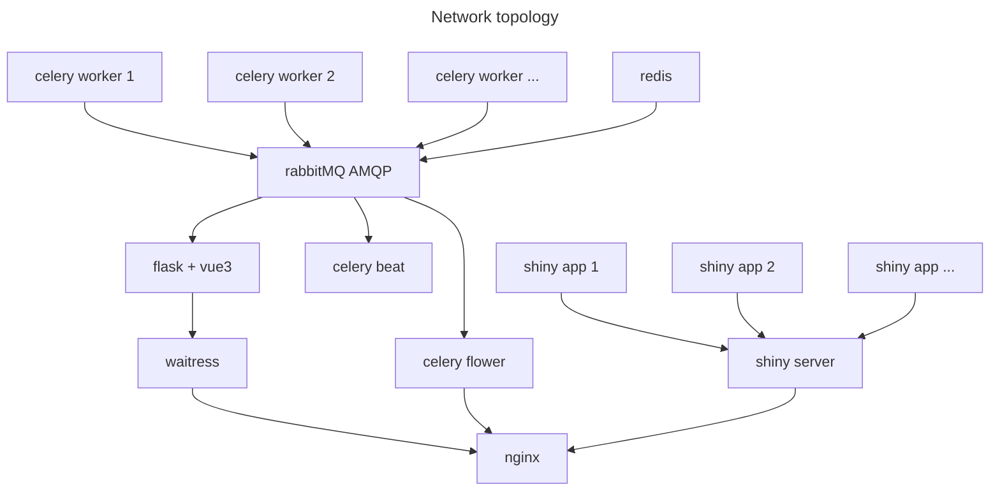

# Accessibility

## Conda

```shell
$ conda install bioconda::rearr
```

## Container

As far as I know, the easiest way to use docker images is `apptainer`. Install `apptainer` by conda.
```shell
conda install conda-forge::apptainer
```

To get an interactive shell environment,
```shell
$ apptainer shell docker://ghcr.io/ljw20180420/rearr:latest
Apptainer> rearrangement -h
```

To run commands non-interactively,
```shell
$ apptainer run docker://ghcr.io/ljw20180420/rearr:latest rearrangement -h
```
This is handy when you want to build a pipeline depends on multiple containers.

Containers of `apptainer` share io and network with the host. The current working directory is where you invoke the `apptainer` command like `shell` or `run`.

## WebUI

This project has a webUI. The webUI contains a visualizing workflow.

- Remove duplicates in fastq files.
- Demultiplex according to markers like sgRNA (this diffs from data to data).
- Extract alignable parts from fastq reads (this diffs from data to data).
- Align reads chimerically.

The webUI also contains shiny apps for post process and visualization.

The webUI is too heavy to release as conda package. There is a prebuild [github docker package](https://ghcr.io/ljw20180420/rearr). To launch the webUI locally, either clone the repository
```shell
$ git clone https://github.com/ljw20180420/rearr.git
```
or download the latest working [release](https://github.com/ljw20180420/rearr/releases). Then in the project folder, invoke
```shell
$ docker-images/compose.sh
```
The webUI is served at `http://ocalhost:80`.
  - The visualizing workflow is at `http://ocalhost:80/workflow/`.
  - The shiny apps for post process and visualization is at `http://ocalhost:80/shiny/`.
  - The job history of the visualizing workflow can be checked at `http://ocalhost:80/flower/`.

The first running of `docker-images/compose.sh` will pull the following images.

- ghcr.io/ljw20180420/flask_app:latest
- ghcr.io/ljw20180420/rearr:latest
- rabbitmq:latest
- redis:latest
- mher/flower:latest
- nginx:latest



A dedicated web server is at [qiangwulab](https://qiangwulab.sjtu.edu.cn).

# Documentation

[Here](https://ljw20180420.github.io/rearr/).

# TODO
```[tasklist]
- [ ] Clarify why bioconda meta.yaml not work after using inline test commands instead of run_test.sh
- [ ] deploy to 交我算生信平台
- [ ] deploy to galaxy
- [ ] improve BWT-SW and apply it to the sgRNA library demultiplex and genome-wide CRISPR
    - [ ] regex DFA and NFA
    - [ ] SIMD
    - [ ] prune resembling repeat alignment
    - [ ] statistic algorithm
    - [ ] decrease memory usage by record DNA in 2bit
    - [ ] load suffix array into memory
- [ ] list bad examples in benchmark
- [ ] Write core functions in c++
- [ ] Add assumption check.
- [ ] Rewrite pruned backtracking.
- [ ] Add a simulation for branch-and-bound backtracking.
- [ ] Resemble outputs of previous software
- [ ] Use small genome data to recover genome test.
- [ ] compare with divide-and-conquer
- [ ] modulerize demultiplex
- [ ] add manim to show the core algorithm of rearr
- [ ] add method to search genome-wide off-target for sequences not found in sgRNA libraries
- [ ] add benchmark to demultiplex
- [ ] github action to deploy to qiangwulab.sjtu.edu.cn
- [ ] add github wiki
- [ ] other CDCI support by github (git -> github cli -> github docs|skills|support|community)
- [ ] use functools LRU-cache to speed up python code
- [ ] add benchmark for SIQ: https://github.com/RobinVanSchendel/SIQ
- [ ] add benchmark for PEM-Q: https://github.com/liumz93/PEM-Q
- [ ] convert alg to sam
- [ ] Deploy to JCloud. Celery flower does not work properly on JCloud. Maybe permission problem.
- [ ] asgi is more advance than wsgi
- [ ] resemble indelphi to explicitly list sequences
- [ ] implement tidymodels (need to install tidymodels in shiny rocker, not install by apt)
- [ ] CDN
- [ ] Use explicit base in shiny app microHomology
- [ ] Use probability language to inplement Gibbs sampling for predicting the frequencies of blunt end cleavage events
```

# TODO (Long term)
```[tasklist]
- [ ] Use GNU autotools to install Rearrangement
```
